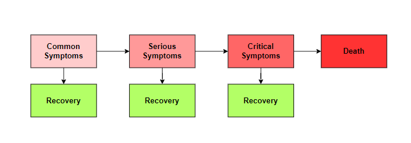
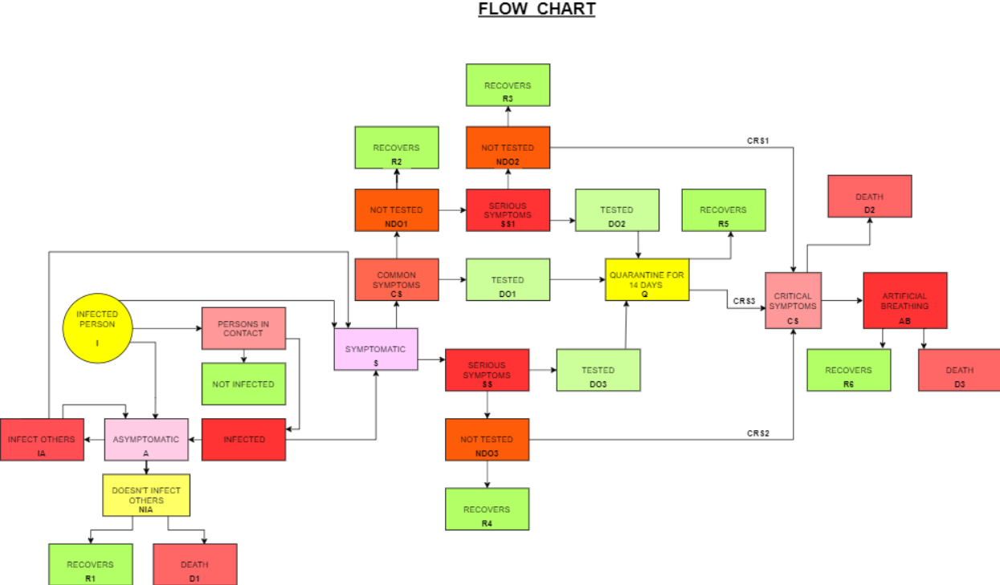
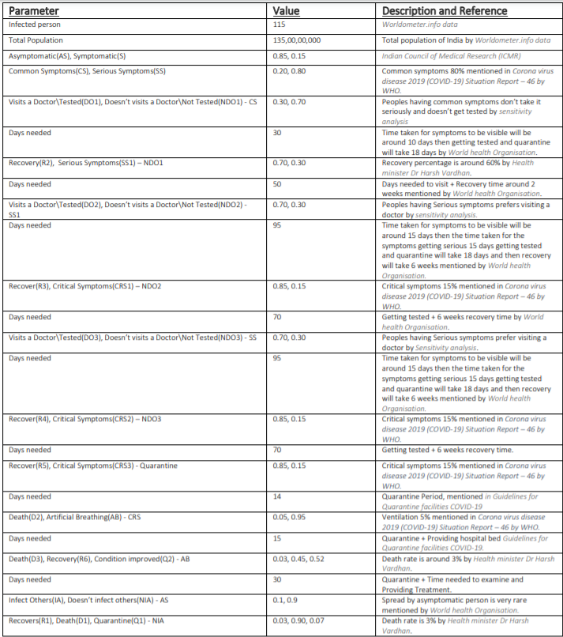

# simulation-model
Simulation Model(robust model) to estimate the propagation and impact of a pandemic.  Analyzed and defined various parameters to predict the data for the COVID 19 cases in India.  Used statistical algorithm and polynomial regression to predict the values and found the relation between the various parameters through Sensitivity Analysis.  Plotted graphs for various possibilities and analyzed trends and seasonality

This is the basic idea behind the model that a person goes through various stages during his recovery period. When a person gets infected there is a chance/probability that he/she will get recoverd or will proceed to the next stage. 

The flow Chart is the base of the model. This shows the possiblities that I cosidered for a person to be infected or getting infected. And what are the chances that a person would get recovered or dies. On the basis of the data collected from various sources the model can predict the Number of person visiting/ not visiting a doctor, Number of recovery and death. 

Table having the parameter values and there sources:

